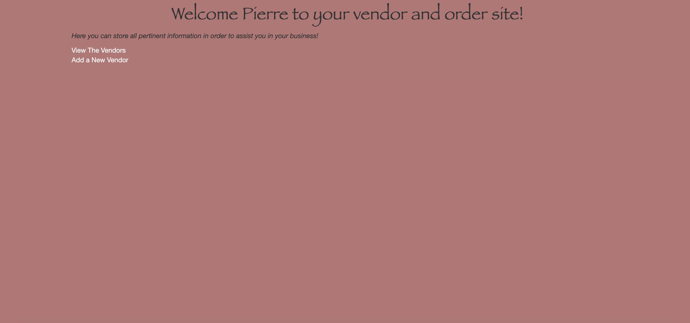
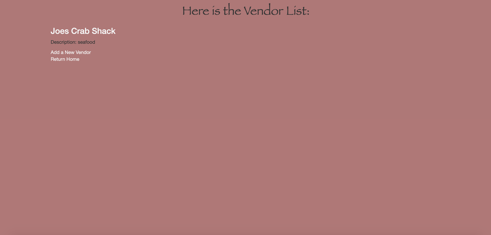
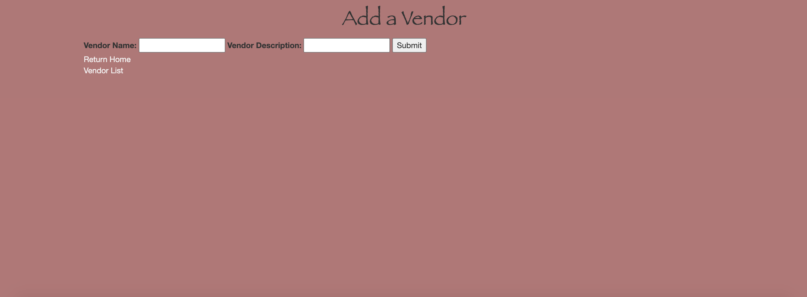
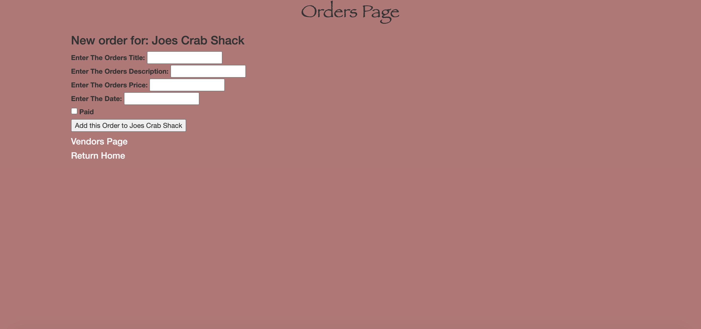

# _Bakery Vendor Tracker_

### _C# Vendor Tracking Website, 1-04-2021_

### By Svea Wade 

### Description
This is an MVC application to allow Pierre to track invoices pertaing to his vendors. 

Vendors include properties for the vendor's name, a description and a list of all the orders the vendor has places. An order includes the title, the description, the price, the date and a checkbox of whether or not it was paid for.

The homepage of the app at the root path (localhost:5000/) 

The Vendor List page (localhost:5000/vendors)

The Add a Vendor page (localhost:5000/vendors/new)

The Vendor Order page (localhost:5000/vendors/1/orders)

The New Order Page(localhost:5000/vendors/1/orders/new)

## Setup/Installation Requirements

Requires .NET Core 2.2 and C# 7.3

You can open it locally within your computer by cloning the repository here https://github.com/svealinnea/BakeryMVC

Here are some instructions on how to do so:

1. You will need an internet browser & a code editor installed on your computer. Examples include: VSCode.
2. When you open the link above you will need to click on the "clone or download button"
3. You will then need to clone it on your computer in your terminal run the command git Clone https://github.com/svealinnea/BakeryMVC.git
4. After you clone it you will need to open it in your preferred code editor
5. You will then want to run the command dotnet restore in order to create the packages neccesary to run the tests and also run the project in the browser.
6. You will then want to run dotnet build followed by dotnet run if you are wanting play with the websites funtionality in the browser. 
7. The program will then let you know where the local version is, for example Now listening on: http://localhost:5000 you will want to click on that and it will take you to the screen where the website is hosted. 

## Known Bugs

No known bugs at the moment. 

## Support and contact details
You can reach out to me via email <svealinneawade@gmail.com>

## Technologies Used

* Git
* Bootstrap
* HTML
* C# 7.3
* .NET Core 2.2
* dotnet script, REPL
* ASP.NET Core MVC
* Razor
* CSS

## Legal

I used the MIT license, see below: Copyright (c) 2020 Svea Wade Permission is hereby granted, free of charge, to any person obtaining a copy of this software and associated documentation files (the "Software"), to deal in the Software without restriction, including without limitation the rights to use, copy, modify, merge, publish, distribute, sublicense, and/or sell copies of the Software, and to permit persons to whom the Software is furnished to do so, subject to the following conditions: The above copyright notice and this permission notice shall be included in all copies or substantial portions of the Software. THE SOFTWARE IS PROVIDED "AS IS", WITHOUT WARRANTY OF ANY KIND, EXPRESS OR IMPLIED, INCLUDING BUT NOT LIMITED TO THE WARRANTIES OF MERCHANTABILITY, FITNESS FOR A PARTICULAR PURPOSE AND NONINFRINGEMENT. IN NO EVENT SHALL THE AUTHORS OR COPYRIGHT HOLDERS BE LIABLE FOR ANY CLAIM, DAMAGES OR OTHER LIABILITY, WHETHER IN AN ACTION OF CONTRACT, TORT OR OTHERWISE, ARISING FROM, OUT OF OR IN CONNECTION WITH THE SOFTWARE OR THE USE OR OTHER DEALINGS IN THE SOFTWARE.
